# v2board安装教程
本教程是基于 @wyx2685 的v2board ，支持webman后的版本。 

项目地址：https://github.com/wyx2685/v2board


**系统建议使用 `Debian 12`以上，本教程是基于`Debian 12`系统部署。**

### 第一步首先安装宝塔

国际版宝塔地址：https://www.aapanel.com/new/download.html

**安装完成后登录宝塔，登录页面语言选择繁体中文，进入面板后安装如下运行环境**

☑️ Nginx 1.24
☑️ MySQL 5.7
☑️ PHP 8.1

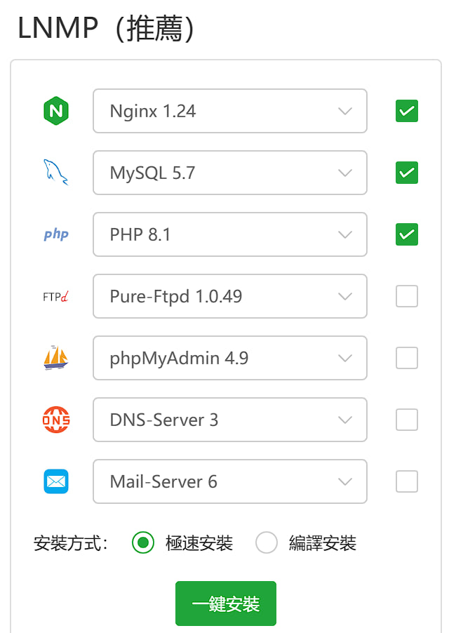

等待安装完毕
预计耗时：10-30分钟之间

---

## 安装Redis、fileinfo、opcache
 宝塔 面板 > 软件商店 > 找到PHP 8.1 点击`设定` > `Install extentions` > 安装`redis`，`fileinfo`，`opcache`扩展。
预计耗时：5分钟

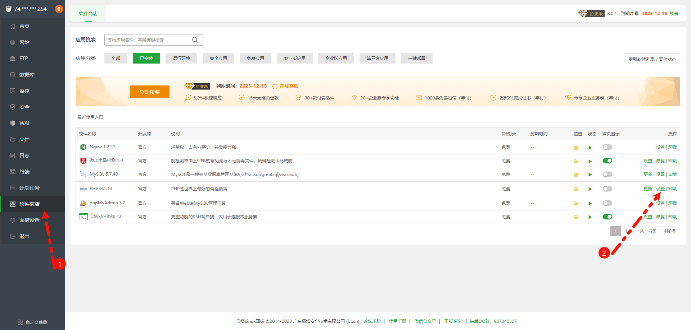 

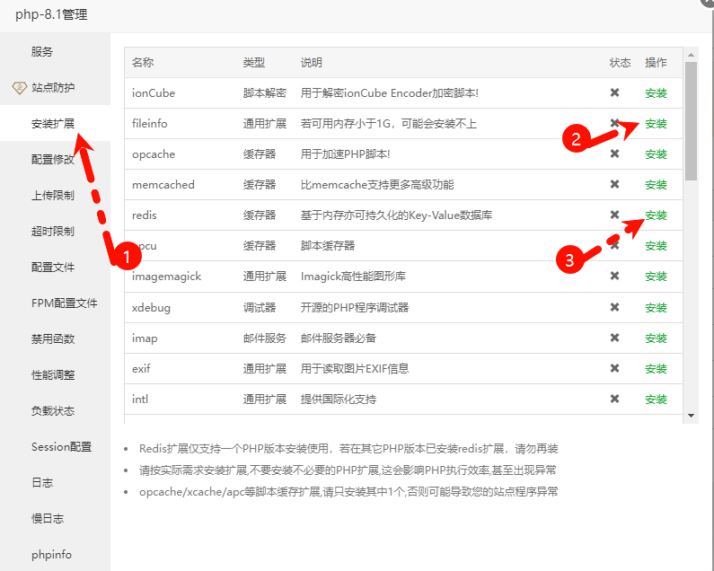 

 

## 解除被禁止的函数
进行这一步之前，建议要等到 `redis`,`fileinfo`,`opcache` 安装完成之后再进行操作。否则可能在安装依赖试提示未禁用 某些函数

宝塔 面板 > 软件商店 > 找到PHP 8.1   点击`设定` > `Disabled functions` 将 `putenv` 、`proc_open`、`pcntl_alarm`、`pcntl_signal` 从列表中删除。
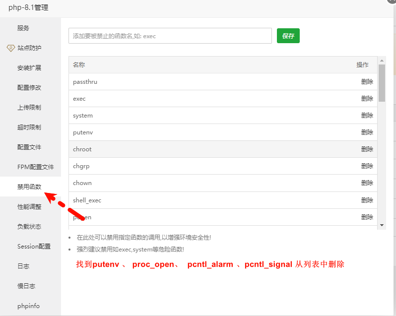 


## 添加站点
宝塔 面板 > 网站 > 添加站点

在 域名 填入你指向服务器的域名
在 Database 选择MySQL
在 PHP Verison 选择PHP-8.1
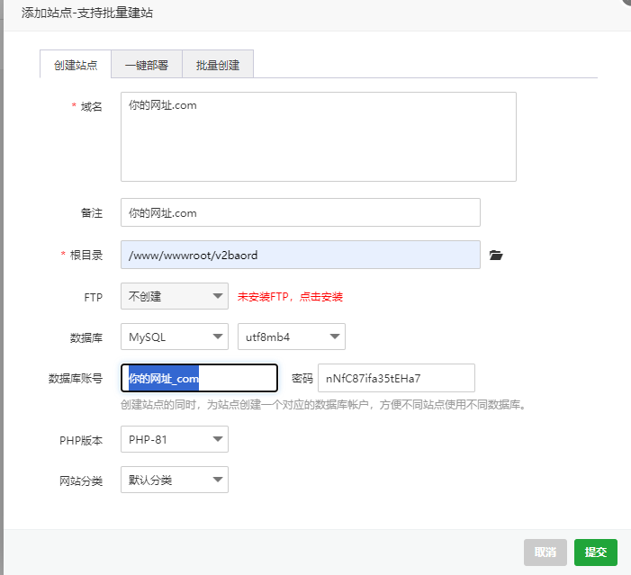 

## 登录到SSH 进行下面的操作


### 首先进入到网站目录下

```
cd /www/wwwroot
```

### 删除目录下所有文件以后执行以下命令
```
git clone https://github.com/wyx2685/v2board.git
```
### 克隆完成后进入目录执行部署命令
```
cd v2board && bash init.sh
```

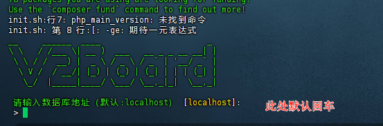 

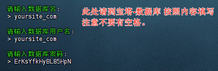 


## 配置站点目录及伪静态

返回到宝塔页面， 选择网站， 点击 网站名，`站点目录`跟我保持一样

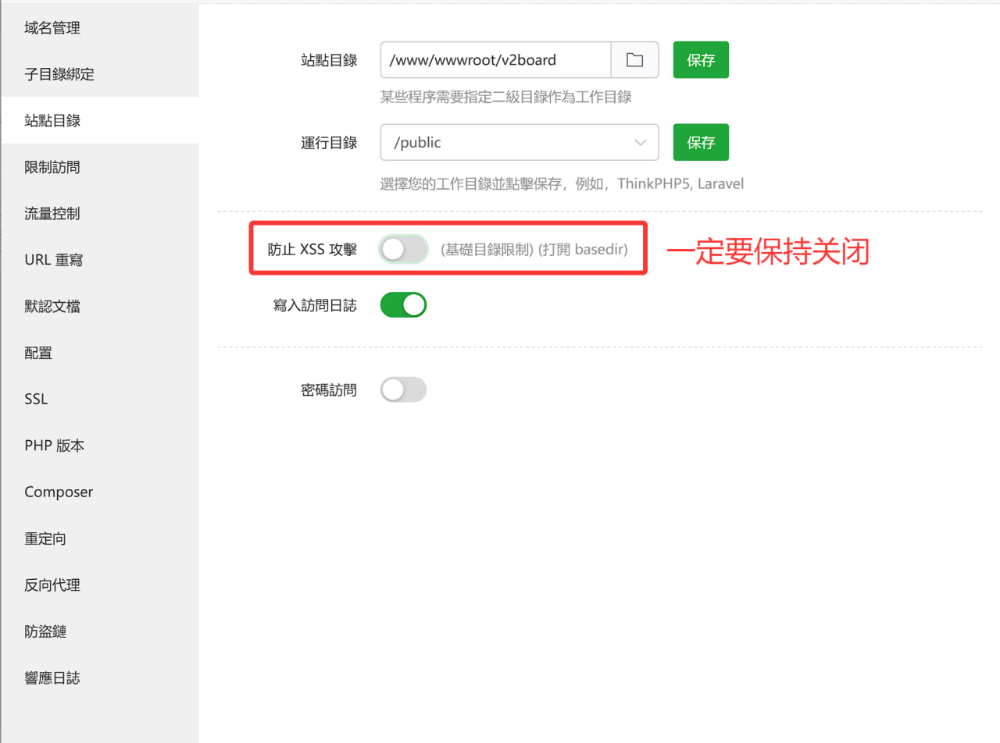


## 然后选择`URL重寫`，也就是伪静态，填写以下内容
```
location /downloads {
}

location / {
try_files $uri $uri/ @backend;
}

location ~ (/config/|/manage/|/webhook|/payment|/order|/theme/) {
try_files $uri $uri/ /index.php$is_args$query_string;
}

location @backend {
proxy_set_header Host $http_host;
proxy_pass http://127.0.0.1:6600;
}

location ~ .*\.(js|css)?$
{
expires 1h;
error_log off;
access_log /dev/null; 
}
```
## 配置定时任务
宝塔 面板 >计划任务

```
任务类型--------Shell脚本
任务名称--------V2B基本任务
执行周期--------N分钟 1分钟
脚本内容--------php /www/wwwroot/v2board/artisan schedule:run
```
根据上述信息添加每1分钟执行一次的定时任务。

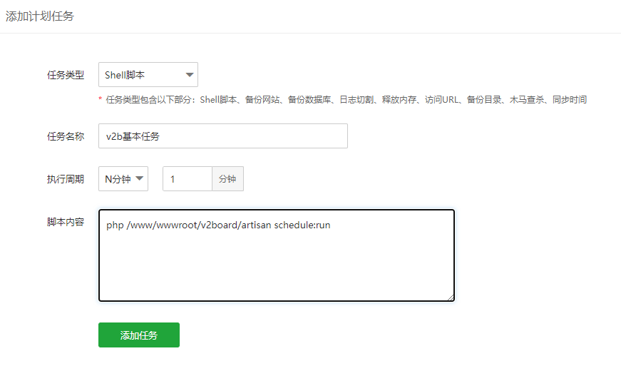 


## 守护任务及启用webman
打开宝塔-点击软件商店-应用搜索 `Supervisor` 执行安装，中文版宝塔则是叫`进程守护管理器`

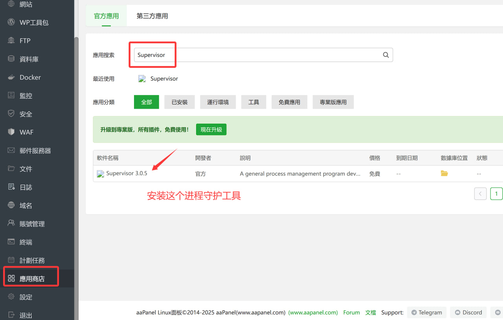 

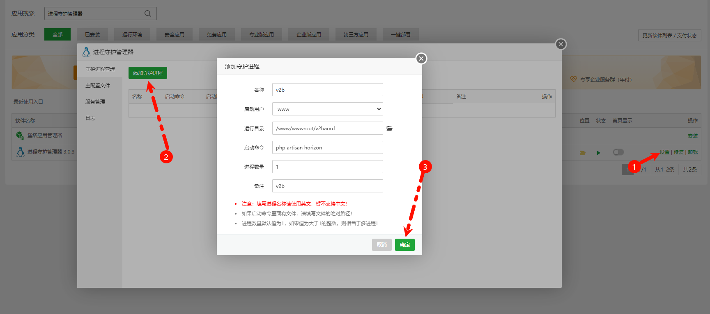 

**添加启动命令**
```
php artisan horizon
```

**同样的操作，再添加一个如下命令，出现进程ID后证明启动成功**
```
php -c cli-php.ini webman.php start
```

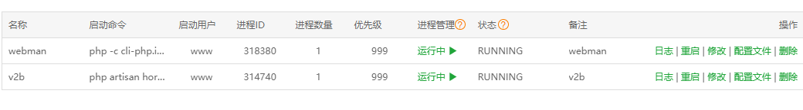 


### 最后点击网站，进入网站设置，申请SSL证书就搭建完成了

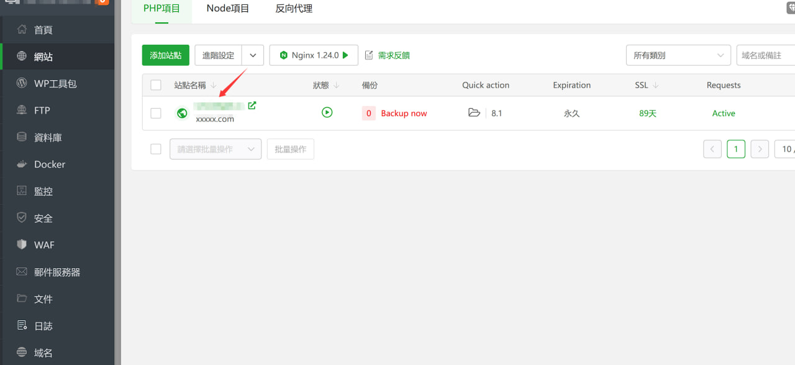

###  注意

启用webman后做的任何代码修改都需要`重启PHP`和`重启webman`才会生效

---


鸣谢：https://github.com/vlesstop/xiaoV2b
